# Heaps — carte des dépendances

> Généré par `tools/docgen/deps.py` (analyse statique, sans compilateur Haxe). Ne pas éditer à la main.

- Modules (fichiers `.hx`) : **554** — lignes : **151052** — packages : **44**
- Dépendances module→module : **2779**
- Cycles de modules (SCC > 1) : **18**

Légende des types d'arêtes : `import`, `using`, `extends`, `implements`, `use` (référence dans le code).

## Packages

| Package | Modules | Lignes | Blocs doc `/** */` | Dépend de (packages) | Utilisé par |
|---|---:|---:|---:|---|---|
| [`h2d`](modules/h2d.md) | 34 | 16680 | 927 | h2d.col, h2d.filter, h2d.impl, h3d, h3d.impl, h3d.mat, h3d.pass, h3d.prim, h3d.scene, h3d.scene.pbr, h3d.shader, hxd, hxd.earcut, hxd.fmt.kframes, hxd.impl, hxd.poly2tri, hxd.res, hxsl | 13 |
| [`h2d.col`](modules/h2d.col.md) | 22 | 5683 | 383 | h2d.impl, h3d.col, hxd, hxd.clipper, hxd.earcut, hxd.impl | 11 |
| [`h2d.domkit`](modules/h2d.domkit.md) | 4 | 2210 | 56 | h2d, h2d.col, h2d.filter, h3d, h3d.mat, h3d.scene, hxd, hxd.fs, hxd.res | 0 |
| [`h2d.filter`](modules/h2d.filter.md) | 16 | 1174 | 79 | h2d, h2d.col, h3d, h3d.mat, h3d.pass, h3d.shader, h3d.shader.pbr, hxd | 2 |
| [`h2d.impl`](modules/h2d.impl.md) | 2 | 316 | 33 | h2d, h3d, h3d.mat | 4 |
| [`h3d`](modules/h3d.md) | 11 | 4370 | 370 | h2d.col, h2d.impl, h3d.col, h3d.impl, h3d.mat, h3d.scene, hxd, hxd.impl, hxd.res, hxsl | 30 |
| [`h3d.anim`](modules/h3d.anim.md) | 9 | 2937 | 181 | h2d.col, h3d, h3d.col, h3d.prim, h3d.scene, h3d.shader, hxd, hxd.impl | 5 |
| [`h3d.col`](modules/h3d.col.md) | 20 | 4342 | 367 | h2d.col, h2d.impl, h3d, h3d.prim, h3d.scene, hxd, hxd.fs, hxd.impl | 13 |
| [`h3d.impl`](modules/h3d.impl.md) | 23 | 16447 | 819 | h2d, h2d.col, h3d, h3d.mat, h3d.pass, h3d.scene, h3d.shader, hxd, hxd.impl, hxd.res, hxsl | 9 |
| [`h3d.mat`](modules/h3d.mat.md) | 17 | 3886 | 315 | h2d, h2d.col, h3d, h3d.col, h3d.impl, h3d.pass, h3d.scene, h3d.scene.fwd, h3d.scene.pbr, h3d.shader, h3d.shader.pbr, hxd, hxd.fs, hxd.impl, hxd.res, hxsl | 16 |
| [`h3d.mat.noise`](modules/h3d.mat.noise.md) | 1 | 169 | 4 | h3d, h3d.col, h3d.mat, h3d.pass, h3d.shader, hxd, hxsl | 0 |
| [`h3d.parts`](modules/h3d.parts.md) | 6 | 2726 | 243 | h2d, h3d, h3d.col, h3d.mat, h3d.prim, h3d.scene, h3d.shader, hxd, hxd.impl, hxd.res | 0 |
| [`h3d.pass`](modules/h3d.pass.md) | 28 | 3723 | 212 | h2d.col, h3d, h3d.col, h3d.impl, h3d.mat, h3d.prim, h3d.scene, h3d.scene.pbr, h3d.shader, h3d.shader.pbr, hxd, hxsl | 8 |
| [`h3d.prim`](modules/h3d.prim.md) | 23 | 4415 | 222 | h3d, h3d.anim, h3d.col, h3d.impl, h3d.mat, h3d.scene, h3d.shader, hxd, hxd.fmt.hmd, hxd.fs, hxd.impl, hxd.res | 10 |
| [`h3d.scene`](modules/h3d.scene.md) | 22 | 10163 | 573 | h2d.col, h3d, h3d.anim, h3d.col, h3d.impl, h3d.mat, h3d.pass, h3d.prim, h3d.scene.pbr, h3d.shader, hxd, hxd.fmt.hmd, hxd.impl, hxd.res, hxsl | 15 |
| [`h3d.scene.fwd`](modules/h3d.scene.fwd.md) | 5 | 394 | 24 | h3d, h3d.col, h3d.pass, h3d.scene, h3d.shader, hxd, hxsl | 1 |
| [`h3d.scene.pbr`](modules/h3d.scene.pbr.md) | 11 | 3432 | 122 | h3d, h3d.col, h3d.impl, h3d.mat, h3d.pass, h3d.prim, h3d.scene, h3d.shader, h3d.shader.pbr, hxd, hxd.res, hxsl | 4 |
| [`h3d.shader`](modules/h3d.shader.md) | 68 | 3949 | 124 | h3d, h3d.mat, hxd.impl, hxsl | 15 |
| [`h3d.shader.pbr`](modules/h3d.shader.pbr.md) | 20 | 2689 | 44 | h3d, h3d.shader, hxsl | 4 |
| [`hxd`](modules/hxd.md) | 33 | 10383 | 837 | h2d, h3d, h3d.scene, hxd.fmt.pak, hxd.fs, hxd.impl, hxd.res, hxsl | 33 |
| [`hxd.clipper`](modules/hxd.clipper.md) | 7 | 4191 | 42 | h2d.col, hxd | 1 |
| [`hxd.earcut`](modules/hxd.earcut.md) | 1 | 643 | 16 | hxd | 2 |
| [`hxd.fmt.bfnt`](modules/hxd.fmt.bfnt.md) | 3 | 436 | 9 | h2d | 2 |
| [`hxd.fmt.blend`](modules/hxd.fmt.blend.md) | 1 | 466 | 44 | — | 0 |
| [`hxd.fmt.fbx`](modules/hxd.fmt.fbx.md) | 7 | 5874 | 120 | h3d, h3d.anim, h3d.col, h3d.prim, h3d.scene, hxd, hxd.fmt.hmd, hxd.impl, hxd.tools | 2 |
| [`hxd.fmt.grd`](modules/hxd.fmt.grd.md) | 2 | 311 | 28 | — | 1 |
| [`hxd.fmt.hbson`](modules/hxd.fmt.hbson.md) | 2 | 200 | 6 | — | 1 |
| [`hxd.fmt.hdr`](modules/hxd.fmt.hdr.md) | 1 | 100 | 2 | hxd | 1 |
| [`hxd.fmt.hmd`](modules/hxd.fmt.hmd.md) | 5 | 3040 | 192 | h2d, h3d, h3d.anim, h3d.col, h3d.mat, h3d.prim, h3d.scene, h3d.shader, hxd, hxd.fmt.fbx, hxd.impl, hxd.res, hxd.tools | 5 |
| [`hxd.fmt.kframes`](modules/hxd.fmt.kframes.md) | 1 | 138 | 28 | — | 1 |
| [`hxd.fmt.pak`](modules/hxd.fmt.pak.md) | 6 | 1010 | 60 | h2d, h3d, hxd, hxd.fs, hxd.impl, hxd.net, hxd.res, hxd.snd | 2 |
| [`hxd.fmt.spine`](modules/hxd.fmt.spine.md) | 3 | 902 | 140 | h2d, h3d, hxd | 0 |
| [`hxd.fmt.tiff`](modules/hxd.fmt.tiff.md) | 3 | 403 | 51 | hxd, hxd.fmt.pak | 0 |
| [`hxd.fs`](modules/hxd.fs.md) | 15 | 3214 | 182 | h2d, h3d, h3d.anim, h3d.prim, hxd, hxd.fmt.bfnt, hxd.fmt.fbx, hxd.fmt.hbson, hxd.fmt.hmd, hxd.impl, hxd.res | 8 |
| [`hxd.impl`](modules/hxd.impl.md) | 15 | 1501 | 100 | h3d, hxd | 19 |
| [`hxd.net`](modules/hxd.net.md) | 3 | 634 | 36 | — | 1 |
| [`hxd.poly2tri`](modules/hxd.poly2tri.md) | 13 | 2111 | 138 | hxd | 1 |
| [`hxd.res`](modules/hxd.res.md) | 24 | 4717 | 205 | h2d, h3d, h3d.impl, h3d.mat, hxd, hxd.fmt.bfnt, hxd.fmt.grd, hxd.fmt.hdr, hxd.fmt.hmd, hxd.fs, hxd.impl, hxd.snd | 15 |
| [`hxd.snd`](modules/hxd.snd.md) | 14 | 2479 | 162 | h3d, hxd, hxd.impl, hxd.res, hxd.snd.openal, hxd.snd.webaudio | 5 |
| [`hxd.snd.effect`](modules/hxd.snd.effect.md) | 5 | 511 | 159 | h3d, hxd, hxd.snd | 2 |
| [`hxd.snd.openal`](modules/hxd.snd.openal.md) | 7 | 1768 | 272 | h3d, hxd, hxd.snd, hxd.snd.effect, hxd.snd.webaudio | 1 |
| [`hxd.snd.webaudio`](modules/hxd.snd.webaudio.md) | 6 | 911 | 75 | h3d, hxd, hxd.impl, hxd.snd, hxd.snd.effect | 2 |
| [`hxd.tools`](modules/hxd.tools.md) | 4 | 702 | 90 | — | 2 |
| [`hxsl`](modules/hxsl.md) | 31 | 14702 | 431 | h3d, h3d.impl, h3d.mat, h3d.shader, hxd, hxd.fs, hxd.res | 12 |

## Graphe des packages (niveau 2)

```mermaid
flowchart LR
  h2d[h2d] -->|26| h2d_col[h2d.col]
  h2d[h2d] -->|1| h2d_filter[h2d.filter]
  h2d[h2d] -->|3| h2d_impl[h2d.impl]
  h2d[h2d] -->|18| h3d[h3d]
  h2d[h2d] -->|6| h3d_impl[h3d.impl]
  h2d[h2d] -->|11| h3d_mat[h3d.mat]
  h2d[h2d] -->|2| h3d_pass[h3d.pass]
  h2d[h2d] -->|2| h3d_prim[h3d.prim]
  h2d[h2d] -->|4| h3d_scene[h3d.scene]
  h2d[h2d] -->|7| h3d_shader[h3d.shader]
  h2d[h2d] -->|46| hxd[hxd]
  h2d[h2d] -->|1| hxd_earcut[hxd.earcut]
  h2d[h2d] -->|1| hxd_fmt[hxd.fmt]
  h2d[h2d] -->|5| hxd_impl[hxd.impl]
  h2d[h2d] -->|1| hxd_poly2tri[hxd.poly2tri]
  h2d[h2d] -->|6| hxd_res[hxd.res]
  h2d[h2d] -->|9| hxsl[hxsl]
  h2d_col[h2d.col] -->|2| h2d_impl[h2d.impl]
  h2d_col[h2d.col] -->|1| h3d_col[h3d.col]
  h2d_col[h2d.col] -->|17| hxd[hxd]
  h2d_col[h2d.col] -->|2| hxd_clipper[hxd.clipper]
  h2d_col[h2d.col] -->|1| hxd_earcut[hxd.earcut]
  h2d_col[h2d.col] -->|5| hxd_impl[hxd.impl]
  h2d_domkit[h2d.domkit] -->|19| h2d[h2d]
  h2d_domkit[h2d.domkit] -->|1| h2d_col[h2d.col]
  h2d_domkit[h2d.domkit] -->|7| h2d_filter[h2d.filter]
  h2d_domkit[h2d.domkit] -->|2| h3d[h3d]
  h2d_domkit[h2d.domkit] -->|1| h3d_mat[h3d.mat]
  h2d_domkit[h2d.domkit] -->|1| h3d_scene[h3d.scene]
  h2d_domkit[h2d.domkit] -->|8| hxd[hxd]
  h2d_domkit[h2d.domkit] -->|2| hxd_fs[hxd.fs]
  h2d_domkit[h2d.domkit] -->|8| hxd_res[hxd.res]
  h2d_filter[h2d.filter] -->|38| h2d[h2d]
  h2d_filter[h2d.filter] -->|5| h2d_col[h2d.col]
  h2d_filter[h2d.filter] -->|2| h3d[h3d]
  h2d_filter[h2d.filter] -->|1| h3d_mat[h3d.mat]
  h2d_filter[h2d.filter] -->|14| h3d_pass[h3d.pass]
  h2d_filter[h2d.filter] -->|7| h3d_shader[h3d.shader]
  h2d_filter[h2d.filter] -->|2| hxd[hxd]
  h2d_impl[h2d.impl] -->|2| h2d[h2d]
  h2d_impl[h2d.impl] -->|2| h3d[h3d]
  h2d_impl[h2d.impl] -->|1| h3d_mat[h3d.mat]
  h3d[h3d] -->|2| h2d_col[h2d.col]
  h3d[h3d] -->|1| h2d_impl[h2d.impl]
  h3d[h3d] -->|5| h3d_col[h3d.col]
  h3d[h3d] -->|11| h3d_impl[h3d.impl]
  h3d[h3d] -->|3| h3d_mat[h3d.mat]
  h3d[h3d] -->|1| h3d_scene[h3d.scene]
  h3d[h3d] -->|14| hxd[hxd]
  h3d[h3d] -->|3| hxd_impl[hxd.impl]
  h3d[h3d] -->|1| hxd_res[hxd.res]
  h3d[h3d] -->|1| hxsl[hxsl]
  h3d_anim[h3d.anim] -->|3| h2d_col[h2d.col]
  h3d_anim[h3d.anim] -->|12| h3d[h3d]
  h3d_anim[h3d.anim] -->|1| h3d_col[h3d.col]
  h3d_anim[h3d.anim] -->|1| h3d_prim[h3d.prim]
  h3d_anim[h3d.anim] -->|10| h3d_scene[h3d.scene]
  h3d_anim[h3d.anim] -->|2| h3d_shader[h3d.shader]
  h3d_anim[h3d.anim] -->|3| hxd[hxd]
  h3d_anim[h3d.anim] -->|2| hxd_impl[hxd.impl]
  h3d_col[h3d.col] -->|1| h2d_col[h2d.col]
  h3d_col[h3d.col] -->|1| h2d_impl[h2d.impl]
  h3d_col[h3d.col] -->|21| h3d[h3d]
  h3d_col[h3d.col] -->|8| h3d_prim[h3d.prim]
  h3d_col[h3d.col] -->|22| h3d_scene[h3d.scene]
  h3d_col[h3d.col] -->|15| hxd[hxd]
  h3d_col[h3d.col] -->|1| hxd_fs[hxd.fs]
  h3d_col[h3d.col] -->|4| hxd_impl[hxd.impl]
  h3d_impl[h3d.impl] -->|12| h2d[h2d]
  h3d_impl[h3d.impl] -->|3| h2d_col[h2d.col]
  h3d_impl[h3d.impl] -->|33| h3d[h3d]
  h3d_impl[h3d.impl] -->|34| h3d_mat[h3d.mat]
  h3d_impl[h3d.impl] -->|1| h3d_pass[h3d.pass]
  h3d_impl[h3d.impl] -->|5| h3d_scene[h3d.scene]
  h3d_impl[h3d.impl] -->|3| h3d_shader[h3d.shader]
  h3d_impl[h3d.impl] -->|44| hxd[hxd]
  h3d_impl[h3d.impl] -->|3| hxd_impl[hxd.impl]
  h3d_impl[h3d.impl] -->|2| hxd_res[hxd.res]
  h3d_impl[h3d.impl] -->|20| hxsl[hxsl]
  h3d_mat[h3d.mat] -->|1| h2d[h2d]
  h3d_mat[h3d.mat] -->|1| h2d_col[h2d.col]
  h3d_mat[h3d.mat] -->|7| h3d[h3d]
  h3d_mat[h3d.mat] -->|3| h3d_col[h3d.col]
  h3d_mat[h3d.mat] -->|3| h3d_impl[h3d.impl]
  h3d_mat[h3d.mat] -->|6| h3d_pass[h3d.pass]
  h3d_mat[h3d.mat] -->|9| h3d_scene[h3d.scene]
  h3d_mat[h3d.mat] -->|16| h3d_shader[h3d.shader]
  h3d_mat[h3d.mat] -->|10| hxd[hxd]
  h3d_mat[h3d.mat] -->|1| hxd_fs[hxd.fs]
  h3d_mat[h3d.mat] -->|5| hxd_impl[hxd.impl]
  h3d_mat[h3d.mat] -->|6| hxd_res[hxd.res]
  h3d_mat[h3d.mat] -->|7| hxsl[hxsl]
  h3d_parts[h3d.parts] -->|2| h2d[h2d]
  h3d_parts[h3d.parts] -->|6| h3d[h3d]
  h3d_parts[h3d.parts] -->|2| h3d_col[h3d.col]
  h3d_parts[h3d.parts] -->|3| h3d_mat[h3d.mat]
  h3d_parts[h3d.parts] -->|3| h3d_prim[h3d.prim]
  h3d_parts[h3d.parts] -->|5| h3d_scene[h3d.scene]
  h3d_parts[h3d.parts] -->|3| h3d_shader[h3d.shader]
  h3d_parts[h3d.parts] -->|7| hxd[hxd]
  h3d_parts[h3d.parts] -->|1| hxd_impl[hxd.impl]
  h3d_parts[h3d.parts] -->|3| hxd_res[hxd.res]
  h3d_pass[h3d.pass] -->|1| h2d_col[h2d.col]
  h3d_pass[h3d.pass] -->|26| h3d[h3d]
  h3d_pass[h3d.pass] -->|12| h3d_col[h3d.col]
  h3d_pass[h3d.pass] -->|5| h3d_impl[h3d.impl]
  h3d_pass[h3d.pass] -->|28| h3d_mat[h3d.mat]
  h3d_pass[h3d.pass] -->|4| h3d_prim[h3d.prim]
  h3d_pass[h3d.pass] -->|20| h3d_scene[h3d.scene]
  h3d_pass[h3d.pass] -->|22| h3d_shader[h3d.shader]
  h3d_pass[h3d.pass] -->|14| hxd[hxd]
  h3d_pass[h3d.pass] -->|15| hxsl[hxsl]
  h3d_prim[h3d.prim] -->|37| h3d[h3d]
  h3d_prim[h3d.prim] -->|2| h3d_anim[h3d.anim]
  h3d_prim[h3d.prim] -->|42| h3d_col[h3d.col]
  h3d_prim[h3d.prim] -->|1| h3d_impl[h3d.impl]
  h3d_prim[h3d.prim] -->|1| h3d_mat[h3d.mat]
  h3d_prim[h3d.prim] -->|3| h3d_scene[h3d.scene]
  h3d_prim[h3d.prim] -->|1| h3d_shader[h3d.shader]
  h3d_prim[h3d.prim] -->|37| hxd[hxd]
  h3d_prim[h3d.prim] -->|6| hxd_fmt[hxd.fmt]
  h3d_prim[h3d.prim] -->|2| hxd_fs[hxd.fs]
  h3d_prim[h3d.prim] -->|7| hxd_impl[hxd.impl]
  h3d_prim[h3d.prim] -->|6| hxd_res[hxd.res]
  h3d_scene[h3d.scene] -->|2| h2d_col[h2d.col]
  h3d_scene[h3d.scene] -->|66| h3d[h3d]
  h3d_scene[h3d.scene] -->|4| h3d_anim[h3d.anim]
  h3d_scene[h3d.scene] -->|40| h3d_col[h3d.col]
  h3d_scene[h3d.scene] -->|11| h3d_impl[h3d.impl]
  h3d_scene[h3d.scene] -->|36| h3d_mat[h3d.mat]
  h3d_scene[h3d.scene] -->|27| h3d_pass[h3d.pass]
  h3d_scene[h3d.scene] -->|20| h3d_prim[h3d.prim]
  h3d_scene[h3d.scene] -->|32| h3d_shader[h3d.shader]
  h3d_scene[h3d.scene] -->|60| hxd[hxd]
  h3d_scene[h3d.scene] -->|1| hxd_fmt[hxd.fmt]
  h3d_scene[h3d.scene] -->|7| hxd_impl[hxd.impl]
  h3d_scene[h3d.scene] -->|8| hxd_res[hxd.res]
  h3d_scene[h3d.scene] -->|31| hxsl[hxsl]
  h3d_shader[h3d.shader] -->|7| h3d[h3d]
  h3d_shader[h3d.shader] -->|5| h3d_mat[h3d.mat]
  h3d_shader[h3d.shader] -->|1| hxd_impl[hxd.impl]
  h3d_shader[h3d.shader] -->|72| hxsl[hxsl]
  hxd[hxd] -->|2| h2d[h2d]
  hxd[hxd] -->|8| h3d[h3d]
  hxd[hxd] -->|1| h3d_scene[h3d.scene]
  hxd[hxd] -->|1| hxd_fmt[hxd.fmt]
  hxd[hxd] -->|2| hxd_fs[hxd.fs]
  hxd[hxd] -->|8| hxd_impl[hxd.impl]
  hxd[hxd] -->|3| hxd_res[hxd.res]
  hxd[hxd] -->|1| hxsl[hxsl]
  hxd_clipper[hxd.clipper] -->|4| h2d_col[h2d.col]
  hxd_clipper[hxd.clipper] -->|1| hxd[hxd]
  hxd_earcut[hxd.earcut] -->|1| hxd[hxd]
  hxd_fmt[hxd.fmt] -->|12| h2d[h2d]
  hxd_fmt[hxd.fmt] -->|18| h3d[h3d]
  hxd_fmt[hxd.fmt] -->|11| h3d_anim[h3d.anim]
  hxd_fmt[hxd.fmt] -->|10| h3d_col[h3d.col]
  hxd_fmt[hxd.fmt] -->|5| h3d_mat[h3d.mat]
  hxd_fmt[hxd.fmt] -->|7| h3d_prim[h3d.prim]
  hxd_fmt[hxd.fmt] -->|10| h3d_scene[h3d.scene]
  hxd_fmt[hxd.fmt] -->|4| h3d_shader[h3d.shader]
  hxd_fmt[hxd.fmt] -->|29| hxd[hxd]
  hxd_fmt[hxd.fmt] -->|3| hxd_fs[hxd.fs]
  hxd_fmt[hxd.fmt] -->|4| hxd_impl[hxd.impl]
  hxd_fmt[hxd.fmt] -->|1| hxd_net[hxd.net]
  hxd_fmt[hxd.fmt] -->|5| hxd_res[hxd.res]
  hxd_fmt[hxd.fmt] -->|1| hxd_snd[hxd.snd]
  hxd_fmt[hxd.fmt] -->|3| hxd_tools[hxd.tools]
  hxd_fs[hxd.fs] -->|1| h2d[h2d]
  hxd_fs[hxd.fs] -->|1| h3d[h3d]
  hxd_fs[hxd.fs] -->|1| h3d_anim[h3d.anim]
  hxd_fs[hxd.fs] -->|1| h3d_prim[h3d.prim]
  hxd_fs[hxd.fs] -->|7| hxd[hxd]
  hxd_fs[hxd.fs] -->|7| hxd_fmt[hxd.fmt]
  hxd_fs[hxd.fs] -->|4| hxd_impl[hxd.impl]
  hxd_fs[hxd.fs] -->|5| hxd_res[hxd.res]
  hxd_impl[hxd.impl] -->|9| h3d[h3d]
  hxd_impl[hxd.impl] -->|13| hxd[hxd]
  hxd_poly2tri[hxd.poly2tri] -->|3| hxd[hxd]
  hxd_res[hxd.res] -->|12| h2d[h2d]
  hxd_res[hxd.res] -->|3| h3d[h3d]
  hxd_res[hxd.res] -->|1| h3d_impl[h3d.impl]
  hxd_res[hxd.res] -->|6| h3d_mat[h3d.mat]
  hxd_res[hxd.res] -->|13| hxd[hxd]
  hxd_res[hxd.res] -->|6| hxd_fmt[hxd.fmt]
  hxd_res[hxd.res] -->|7| hxd_fs[hxd.fs]
  hxd_res[hxd.res] -->|1| hxd_impl[hxd.impl]
  hxd_res[hxd.res] -->|7| hxd_snd[hxd.snd]
  hxd_snd[hxd.snd] -->|6| h3d[h3d]
  hxd_snd[hxd.snd] -->|8| hxd[hxd]
  hxd_snd[hxd.snd] -->|3| hxd_impl[hxd.impl]
  hxd_snd[hxd.snd] -->|3| hxd_res[hxd.res]
  hxsl[hxsl] -->|14| h3d[h3d]
  hxsl[hxsl] -->|5| h3d_impl[h3d.impl]
  hxsl[hxsl] -->|5| h3d_mat[h3d.mat]
  hxsl[hxsl] -->|1| h3d_shader[h3d.shader]
  hxsl[hxsl] -->|5| hxd[hxd]
  hxsl[hxsl] -->|2| hxd_fs[hxd.fs]
  hxsl[hxsl] -->|4| hxd_res[hxd.res]
```

## Cycles entre packages

- h2d ⇄ h2d.col ⇄ h2d.filter ⇄ h2d.impl ⇄ h3d ⇄ h3d.anim ⇄ h3d.col ⇄ h3d.impl ⇄ h3d.mat ⇄ h3d.pass ⇄ h3d.prim ⇄ h3d.scene ⇄ h3d.shader ⇄ hxd ⇄ hxd.clipper ⇄ hxd.earcut ⇄ hxd.fmt ⇄ hxd.fs ⇄ hxd.impl ⇄ hxd.poly2tri ⇄ hxd.res ⇄ hxd.snd ⇄ hxsl

## Ordre de documentation suggéré

Ordre topologique (les dépendances d'abord). Les modules entre crochets forment un cycle et doivent être documentés ensemble.

1. [`h2d.BlendMode`](modules/h2d.md#h2dblendmode)
2. [`h2d.impl.PointApi`](modules/h2d.impl.md#h2dimplpointapi)
3. [[`hxd.Math`](modules/hxd.md#hxdmath), [`hxd.Timer`](modules/hxd.md#hxdtimer)]
4. [[`h2d.col.IPoint`](modules/h2d.col.md#h2dcolipoint), [`h2d.col.Matrix`](modules/h2d.col.md#h2dcolmatrix), [`h2d.col.Point`](modules/h2d.col.md#h2dcolpoint)]
5. [`h2d.col.Ray`](modules/h2d.col.md#h2dcolray)
6. [[`h2d.col.Bounds`](modules/h2d.col.md#h2dcolbounds), [`h2d.col.Circle`](modules/h2d.col.md#h2dcolcircle), [`h2d.col.Collider`](modules/h2d.col.md#h2dcolcollider), [`h2d.col.IBounds`](modules/h2d.col.md#h2dcolibounds)]
7. [`h2d.col.Polynomial`](modules/h2d.col.md#h2dcolpolynomial)
8. [[`h3d.Matrix`](modules/h3d.md#h3dmatrix), [`h3d.Quat`](modules/h3d.md#h3dquat), [`h3d.Vector`](modules/h3d.md#h3dvector), [`h3d.Vector4`](modules/h3d.md#h3dvector4), [`h3d.col.Point`](modules/h3d.col.md#h3dcolpoint)]
9. [`hxd.PixelFormat`](modules/hxd.md#hxdpixelformat)
10. [`h3d.mat.Data`](modules/h3d.mat.md#h3dmatdata)
11. [`hxd.impl.AnyProps`](modules/hxd.impl.md#hxdimplanyprops)
12. [`h3d.mat.BlendMode`](modules/h3d.mat.md#h3dmatblendmode)
13. [`hxd.impl.Float32`](modules/hxd.impl.md#hxdimplfloat32)
14. [`hxd.impl.TypedArray`](modules/hxd.impl.md#hxdimpltypedarray)
15. [`hxd.impl.UncheckedBytes`](modules/hxd.impl.md#hxdimpluncheckedbytes)
16. [`hxd.Pixels`](modules/hxd.md#hxdpixels)
17. [`hxd.BitmapData`](modules/hxd.md#hxdbitmapdata)
18. [`hxd.fs.LoadedBitmap`](modules/hxd.fs.md#hxdfsloadedbitmap)
19. [`hxd.impl.ArrayIterator`](modules/hxd.impl.md#hxdimplarrayiterator)
20. [[`hxd.fs.AsyncRead`](modules/hxd.fs.md#hxdfsasyncread), [`hxd.fs.FileEntry`](modules/hxd.fs.md#hxdfsfileentry), [`hxd.fs.FileInput`](modules/hxd.fs.md#hxdfsfileinput)]
21. [`hxd.fs.FileSystem`](modules/hxd.fs.md#hxdfsfilesystem)
22. [`hxd.DropFileEvent`](modules/hxd.md#hxddropfileevent)
23. [`hxd.Event`](modules/hxd.md#hxdevent)
24. [`hxd.Pad`](modules/hxd.md#hxdpad)
25. [`hxd.impl.MouseMode`](modules/hxd.impl.md#hxdimplmousemode)
26. [`hxd.Window.js`](modules/hxd.md#hxdwindowjs)
27. [[`hxd.Cursor`](modules/hxd.md#hxdcursor), [`hxd.System.js`](modules/hxd.md#hxdsystemjs)]
28. [`h3d.col.Plane`](modules/h3d.col.md#h3dcolplane)
29. [`hxd.impl.UInt16`](modules/hxd.impl.md#hxdimpluint16)
30. [`hxd.IndexBuffer`](modules/hxd.md#hxdindexbuffer)
31. [`hxd.clipper.ClipType`](modules/hxd.clipper.md#hxdclippercliptype)
32. [`hxd.clipper.EndType`](modules/hxd.clipper.md#hxdclipperendtype)
33. [`hxd.clipper.JoinType`](modules/hxd.clipper.md#hxdclipperjointype)
34. [`hxd.clipper.PolyFillType`](modules/hxd.clipper.md#hxdclipperpolyfilltype)
35. [`hxd.clipper.PolyType`](modules/hxd.clipper.md#hxdclipperpolytype)
36. [`hxd.clipper.Rect`](modules/hxd.clipper.md#hxdclipperrect)
37. [`h2d.col.Segment`](modules/h2d.col.md#h2dcolsegment)
38. [`hxd.earcut.Earcut`](modules/hxd.earcut.md#hxdearcutearcut)
39. [[`h2d.col.IPolygon`](modules/h2d.col.md#h2dcolipolygon), [`h2d.col.IPolygons`](modules/h2d.col.md#h2dcolipolygons), [`h2d.col.Polygon`](modules/h2d.col.md#h2dcolpolygon), [`h2d.col.PolygonCollider`](modules/h2d.col.md#h2dcolpolygoncollider), [`h2d.col.Polygons`](modules/h2d.col.md#h2dcolpolygons), [`h2d.col.Segments`](modules/h2d.col.md#h2dcolsegments), [`hxd.clipper.Clipper`](modules/hxd.clipper.md#hxdclipperclipper)]
40. [`hxd.impl.BitsBuilder`](modules/hxd.impl.md#hxdimplbitsbuilder)
41. [`hxd.fs.Exclusive`](modules/hxd.fs.md#hxdfsexclusive)
42. [`hxd.fs.BytesFileSystem`](modules/hxd.fs.md#hxdfsbytesfilesystem)
43. [`hxd.res.Resource`](modules/hxd.res.md#hxdresresource)
44. [`hxd.res.AnimGraph`](modules/hxd.res.md#hxdresanimgraph)
45. [`hxd.fmt.hdr.Reader`](modules/hxd.fmt.hdr.md#hxdfmthdrreader)
46. [`hxd.res.NanoJpeg`](modules/hxd.res.md#hxdresnanojpeg)
47. [`h3d.col.FPoint`](modules/h3d.col.md#h3dcolfpoint)
48. [`hxd.impl.BitSet`](modules/hxd.impl.md#hxdimplbitset)
49. [`hxd.FloatBuffer`](modules/hxd.md#hxdfloatbuffer)
50. [`hxd.impl.AllocPos`](modules/hxd.impl.md#hxdimplallocpos)
51. [`hxd.SceneEvents`](modules/hxd.md#hxdsceneevents)
52. [`hxsl.Channel`](modules/hxsl.md#hxslchannel)
53. [`hxd.fmt.fbx.Data`](modules/hxd.fmt.fbx.md#hxdfmtfbxdata)
54. [`hxd.fmt.fbx.Parser`](modules/hxd.fmt.fbx.md#hxdfmtfbxparser)
55. [`hxd.tools.MeshOptimizer`](modules/hxd.tools.md#hxdtoolsmeshoptimizer)
56. [`hxd.tools.Mikktspace`](modules/hxd.tools.md#hxdtoolsmikktspace)
57. [`hxd.tools.VHACD`](modules/hxd.tools.md#hxdtoolsvhacd)
58. [`h3d.col.Seg`](modules/h3d.col.md#h3dcolseg)
59. [`h3d.prim.UV`](modules/h3d.prim.md#h3dprimuv)
60. [`hxd.FloatBufferLoader`](modules/hxd.md#hxdfloatbufferloader)
61. [`hxd.fs.NotFound`](modules/hxd.fs.md#hxdfsnotfound)
62. [`hxd.res.NotFound`](modules/hxd.res.md#hxdresnotfound)
63. [`hxd.res.Prefab`](modules/hxd.res.md#hxdresprefab)
64. [[`hxd.snd.Data`](modules/hxd.snd.md#hxdsnddata), [`hxd.snd.WavData`](modules/hxd.snd.md#hxdsndwavdata)]
65. [`hxd.snd.effect.ReverbPreset`](modules/hxd.snd.effect.md#hxdsndeffectreverbpreset)
66. [`hxd.snd.webaudio.Context`](modules/hxd.snd.webaudio.md#hxdsndwebaudiocontext)
67. [`hxd.snd.Mp3Data`](modules/hxd.snd.md#hxdsndmp3data)
68. [`hxd.snd.OggData`](modules/hxd.snd.md#hxdsndoggdata)
69. [`hxd.File`](modules/hxd.md#hxdfile)
70. [`hxd.Charset`](modules/hxd.md#hxdcharset)
71. [`hxd.fmt.hbson.Writer`](modules/hxd.fmt.hbson.md#hxdfmthbsonwriter)
72. [`h3d.impl.MacroHelper`](modules/h3d.impl.md#h3dimplmacrohelper)
73. [`h3d.impl.ShaderCache`](modules/h3d.impl.md#h3dimplshadercache)
74. [[`h2d.Bitmap`](modules/h2d.md#h2dbitmap), [`h2d.Camera`](modules/h2d.md#h2dcamera), [`h2d.Drawable`](modules/h2d.md#h2ddrawable), [`h2d.Font`](modules/h2d.md#h2dfont), [`h2d.Interactive`](modules/h2d.md#h2dinteractive), [`h2d.Layers`](modules/h2d.md#h2dlayers), [`h2d.Object`](modules/h2d.md#h2dobject), [`h2d.RenderContext`](modules/h2d.md#h2drendercontext), [`h2d.Scene`](modules/h2d.md#h2dscene), [`h2d.Tile`](modules/h2d.md#h2dtile), [`h2d.filter.Filter`](modules/h2d.filter.md#h2dfilterfilter), [`h3d.Buffer`](modules/h3d.md#h3dbuffer), [`h3d.BufferHandle`](modules/h3d.md#h3dbufferhandle), [`h3d.Camera`](modules/h3d.md#h3dcamera), [`h3d.Engine`](modules/h3d.md#h3dengine), [`h3d.IDrawable`](modules/h3d.md#h3didrawable), [`h3d.Indexes`](modules/h3d.md#h3dindexes), [`h3d.anim.Animation`](modules/h3d.anim.md#h3danimanimation), [`h3d.anim.BufferAnimation`](modules/h3d.anim.md#h3danimbufferanimation), [`h3d.anim.LinearAnimation`](modules/h3d.anim.md#h3danimlinearanimation), [`h3d.anim.Skin`](modules/h3d.anim.md#h3danimskin), [`h3d.col.Bounds`](modules/h3d.col.md#h3dcolbounds), [`h3d.col.Capsule`](modules/h3d.col.md#h3dcolcapsule), [`h3d.col.Collider`](modules/h3d.col.md#h3dcolcollider), [`h3d.col.Cylinder`](modules/h3d.col.md#h3dcolcylinder), [`h3d.col.Frustum`](modules/h3d.col.md#h3dcolfrustum), [`h3d.col.ObjectCollider`](modules/h3d.col.md#h3dcolobjectcollider), [`h3d.col.OrientedBounds`](modules/h3d.col.md#h3dcolorientedbounds), [`h3d.col.Polygon`](modules/h3d.col.md#h3dcolpolygon), [`h3d.col.PolygonBuffer`](modules/h3d.col.md#h3dcolpolygonbuffer), [`h3d.col.Ray`](modules/h3d.col.md#h3dcolray), [`h3d.col.SkinCollider`](modules/h3d.col.md#h3dcolskincollider), [`h3d.col.Sphere`](modules/h3d.col.md#h3dcolsphere), [`h3d.col.TransformCollider`](modules/h3d.col.md#h3dcoltransformcollider), [`h3d.impl.DX12Driver`](modules/h3d.impl.md#h3dimpldx12driver), [`h3d.impl.DirectXDriver`](modules/h3d.impl.md#h3dimpldirectxdriver), [`h3d.impl.Driver`](modules/h3d.impl.md#h3dimpldriver), [`h3d.impl.GlDriver`](modules/h3d.impl.md#h3dimplgldriver), [`h3d.impl.InstanceBuffer`](modules/h3d.impl.md#h3dimplinstancebuffer), [`h3d.impl.MemoryManager`](modules/h3d.impl.md#h3dimplmemorymanager), [`h3d.impl.NullDriver`](modules/h3d.impl.md#h3dimplnulldriver), [`h3d.impl.PipelineCache`](modules/h3d.impl.md#h3dimplpipelinecache), [`h3d.impl.RenderContext`](modules/h3d.impl.md#h3dimplrendercontext), [`h3d.impl.RendererFX`](modules/h3d.impl.md#h3dimplrendererfx), [`h3d.impl.SceneProf`](modules/h3d.impl.md#h3dimplsceneprof), [`h3d.impl.TextureCache`](modules/h3d.impl.md#h3dimpltexturecache), [`h3d.impl.Upscaling`](modules/h3d.impl.md#h3dimplupscaling), [`h3d.impl.VulkanDriver`](modules/h3d.impl.md#h3dimplvulkandriver), [`h3d.mat.BaseMaterial`](modules/h3d.mat.md#h3dmatbasematerial), [`h3d.mat.Defaults`](modules/h3d.mat.md#h3dmatdefaults), [`h3d.mat.Material`](modules/h3d.mat.md#h3dmatmaterial), [`h3d.mat.MaterialDatabase`](modules/h3d.mat.md#h3dmatmaterialdatabase), [`h3d.mat.MaterialSetup`](modules/h3d.mat.md#h3dmatmaterialsetup), [`h3d.mat.Pass`](modules/h3d.mat.md#h3dmatpass), [`h3d.mat.PbrMaterial`](modules/h3d.mat.md#h3dmatpbrmaterial), [`h3d.mat.Stencil`](modules/h3d.mat.md#h3dmatstencil), [`h3d.mat.Texture`](modules/h3d.mat.md#h3dmattexture), [`h3d.mat.TextureArray`](modules/h3d.mat.md#h3dmattexturearray), [`h3d.mat.TextureHandle`](modules/h3d.mat.md#h3dmattexturehandle), [`h3d.pass.Blur`](modules/h3d.pass.md#h3dpassblur), [`h3d.pass.Copy`](modules/h3d.pass.md#h3dpasscopy), [`h3d.pass.CubeCopy`](modules/h3d.pass.md#h3dpasscubecopy), [`h3d.pass.DefaultShadowMap`](modules/h3d.pass.md#h3dpassdefaultshadowmap), [`h3d.pass.DirShadowMap`](modules/h3d.pass.md#h3dpassdirshadowmap), [`h3d.pass.Output`](modules/h3d.pass.md#h3dpassoutput), [`h3d.pass.OutputShader`](modules/h3d.pass.md#h3dpassoutputshader), [`h3d.pass.PassList`](modules/h3d.pass.md#h3dpasspasslist), [`h3d.pass.PassObject`](modules/h3d.pass.md#h3dpasspassobject), [`h3d.pass.ScreenFx`](modules/h3d.pass.md#h3dpassscreenfx), [`h3d.pass.Shadows`](modules/h3d.pass.md#h3dpassshadows), [`h3d.pass.SortByMaterial`](modules/h3d.pass.md#h3dpasssortbymaterial), [`h3d.prim.BigPrimitive`](modules/h3d.prim.md#h3dprimbigprimitive), [`h3d.prim.Blendshape`](modules/h3d.prim.md#h3dprimblendshape), [`h3d.prim.Capsule`](modules/h3d.prim.md#h3dprimcapsule), [`h3d.prim.ColliderData`](modules/h3d.prim.md#h3dprimcolliderdata), [`h3d.prim.Cube`](modules/h3d.prim.md#h3dprimcube), [`h3d.prim.Cylinder`](modules/h3d.prim.md#h3dprimcylinder), [`h3d.prim.Disc`](modules/h3d.prim.md#h3dprimdisc), [`h3d.prim.HMDModel`](modules/h3d.prim.md#h3dprimhmdmodel), [`h3d.prim.Instanced`](modules/h3d.prim.md#h3dpriminstanced), [`h3d.prim.MeshPrimitive`](modules/h3d.prim.md#h3dprimmeshprimitive), [`h3d.prim.ModelDatabase`](modules/h3d.prim.md#h3dprimmodeldatabase), [`h3d.prim.Plane2D`](modules/h3d.prim.md#h3dprimplane2d), [`h3d.prim.Polygon`](modules/h3d.prim.md#h3dprimpolygon), [`h3d.prim.Primitive`](modules/h3d.prim.md#h3dprimprimitive), [`h3d.prim.Quads`](modules/h3d.prim.md#h3dprimquads), [`h3d.prim.Sphere`](modules/h3d.prim.md#h3dprimsphere), [`h3d.scene.Box`](modules/h3d.scene.md#h3dscenebox), [`h3d.scene.Graphics`](modules/h3d.scene.md#h3dscenegraphics), [`h3d.scene.Interactive`](modules/h3d.scene.md#h3dsceneinteractive), [`h3d.scene.Light`](modules/h3d.scene.md#h3dscenelight), [`h3d.scene.LightSystem`](modules/h3d.scene.md#h3dscenelightsystem), [`h3d.scene.Mesh`](modules/h3d.scene.md#h3dscenemesh), [`h3d.scene.MultiMaterial`](modules/h3d.scene.md#h3dscenemultimaterial), [`h3d.scene.Object`](modules/h3d.scene.md#h3dsceneobject), [`h3d.scene.RenderContext`](modules/h3d.scene.md#h3dscenerendercontext), [`h3d.scene.Renderer`](modules/h3d.scene.md#h3dscenerenderer), [`h3d.scene.Scene`](modules/h3d.scene.md#h3dscenescene), [`h3d.scene.Skin`](modules/h3d.scene.md#h3dsceneskin), [`h3d.scene.fwd.Light`](modules/h3d.scene.fwd.md#h3dscenefwdlight), [`h3d.scene.fwd.LightSystem`](modules/h3d.scene.fwd.md#h3dscenefwdlightsystem), [`h3d.scene.fwd.Renderer`](modules/h3d.scene.fwd.md#h3dscenefwdrenderer), [`h3d.shader.AmbientLight`](modules/h3d.shader.md#h3dshaderambientlight), [`h3d.shader.Base2d`](modules/h3d.shader.md#h3dshaderbase2d), [`h3d.shader.BaseMesh`](modules/h3d.shader.md#h3dshaderbasemesh), [`h3d.shader.Blendshape`](modules/h3d.shader.md#h3dshaderblendshape), [`h3d.shader.Blur`](modules/h3d.shader.md#h3dshaderblur), [`h3d.shader.Buffers`](modules/h3d.shader.md#h3dshaderbuffers), [`h3d.shader.ColorAdd`](modules/h3d.shader.md#h3dshadercoloradd), [`h3d.shader.ColorKey`](modules/h3d.shader.md#h3dshadercolorkey), [`h3d.shader.ColorMatrix`](modules/h3d.shader.md#h3dshadercolormatrix), [`h3d.shader.DirShadow`](modules/h3d.shader.md#h3dshaderdirshadow), [`h3d.shader.FlipBackFaceNormal`](modules/h3d.shader.md#h3dshaderflipbackfacenormal), [`h3d.shader.GenTexture`](modules/h3d.shader.md#h3dshadergentexture), [`h3d.shader.LineShader`](modules/h3d.shader.md#h3dshaderlineshader), [`h3d.shader.MinMaxShader`](modules/h3d.shader.md#h3dshaderminmaxshader), [`h3d.shader.NormalMap`](modules/h3d.shader.md#h3dshadernormalmap), [`h3d.shader.Parallax`](modules/h3d.shader.md#h3dshaderparallax), [`h3d.shader.ScreenShader`](modules/h3d.shader.md#h3dshaderscreenshader), [`h3d.shader.Shadow`](modules/h3d.shader.md#h3dshadershadow), [`h3d.shader.ShadowSampling`](modules/h3d.shader.md#h3dshadershadowsampling), [`h3d.shader.Skin`](modules/h3d.shader.md#h3dshaderskin), [`h3d.shader.SkinBase`](modules/h3d.shader.md#h3dshaderskinbase), [`h3d.shader.SkinTangent`](modules/h3d.shader.md#h3dshaderskintangent), [`h3d.shader.SpecularTexture`](modules/h3d.shader.md#h3dshaderspeculartexture), [`h3d.shader.Texture`](modules/h3d.shader.md#h3dshadertexture), [`h3d.shader.UVDelta`](modules/h3d.shader.md#h3dshaderuvdelta), [`h3d.shader.VertexColorAlpha`](modules/h3d.shader.md#h3dshadervertexcoloralpha), [`h3d.shader.VolumeDecal`](modules/h3d.shader.md#h3dshadervolumedecal), [`h3d.shader.pbr.AlphaMultiply`](modules/h3d.shader.pbr.md#h3dshaderpbralphamultiply), [`h3d.shader.pbr.GammaCorrect`](modules/h3d.shader.pbr.md#h3dshaderpbrgammacorrect), [`h3d.shader.pbr.PropsTexture`](modules/h3d.shader.pbr.md#h3dshaderpbrpropstexture), [`h3d.shader.pbr.PropsValues`](modules/h3d.shader.pbr.md#h3dshaderpbrpropsvalues), [`h3d.shader.pbr.StrengthValues`](modules/h3d.shader.pbr.md#h3dshaderpbrstrengthvalues), [`hxd.BufferFormat`](modules/hxd.md#hxdbufferformat), [`hxd.fmt.bfnt.FontParser`](modules/hxd.fmt.bfnt.md#hxdfmtbfntfontparser), [`hxd.fmt.bfnt.Reader`](modules/hxd.fmt.bfnt.md#hxdfmtbfntreader), [`hxd.fmt.bfnt.Writer`](modules/hxd.fmt.bfnt.md#hxdfmtbfntwriter), [`hxd.fmt.fbx.BaseLibrary`](modules/hxd.fmt.fbx.md#hxdfmtfbxbaselibrary), [`hxd.fmt.fbx.Geometry`](modules/hxd.fmt.fbx.md#hxdfmtfbxgeometry), [`hxd.fmt.fbx.HMDOut`](modules/hxd.fmt.fbx.md#hxdfmtfbxhmdout), [`hxd.fmt.hmd.Data`](modules/hxd.fmt.hmd.md#hxdfmthmddata), [`hxd.fmt.hmd.Library`](modules/hxd.fmt.hmd.md#hxdfmthmdlibrary), [`hxd.fmt.hmd.Reader`](modules/hxd.fmt.hmd.md#hxdfmthmdreader), [`hxd.fmt.hmd.Writer`](modules/hxd.fmt.hmd.md#hxdfmthmdwriter), [`hxd.fs.Convert`](modules/hxd.fs.md#hxdfsconvert), [`hxd.fs.FileConfig`](modules/hxd.fs.md#hxdfsfileconfig), [`hxd.fs.FileConverter`](modules/hxd.fs.md#hxdfsfileconverter), [`hxd.fs.LocalFileSystem`](modules/hxd.fs.md#hxdfslocalfilesystem), [`hxd.fs.SourceLoader`](modules/hxd.fs.md#hxdfssourceloader), [`hxd.impl.Allocator`](modules/hxd.impl.md#hxdimplallocator), [`hxd.res.Any`](modules/hxd.res.md#hxdresany), [`hxd.res.Image`](modules/hxd.res.md#hxdresimage), [`hxd.res.Loader`](modules/hxd.res.md#hxdresloader), [`hxd.res.Model`](modules/hxd.res.md#hxdresmodel), [`hxd.res.Sound`](modules/hxd.res.md#hxdressound), [`hxd.res.TextureStream`](modules/hxd.res.md#hxdrestexturestream), [`hxd.snd.Channel`](modules/hxd.snd.md#hxdsndchannel), [`hxd.snd.ChannelBase`](modules/hxd.snd.md#hxdsndchannelbase), [`hxd.snd.ChannelGroup`](modules/hxd.snd.md#hxdsndchannelgroup), [`hxd.snd.Driver`](modules/hxd.snd.md#hxdsnddriver), [`hxd.snd.Effect`](modules/hxd.snd.md#hxdsndeffect), [`hxd.snd.Listener`](modules/hxd.snd.md#hxdsndlistener), [`hxd.snd.Manager`](modules/hxd.snd.md#hxdsndmanager), [`hxd.snd.NativeChannel`](modules/hxd.snd.md#hxdsndnativechannel), [`hxd.snd.SoundGroup`](modules/hxd.snd.md#hxdsndsoundgroup), [`hxd.snd.effect.LowPass`](modules/hxd.snd.effect.md#hxdsndeffectlowpass), [`hxd.snd.effect.Pitch`](modules/hxd.snd.effect.md#hxdsndeffectpitch), [`hxd.snd.effect.Reverb`](modules/hxd.snd.effect.md#hxdsndeffectreverb), [`hxd.snd.effect.Spatialization`](modules/hxd.snd.effect.md#hxdsndeffectspatialization), [`hxd.snd.openal.AudioTypes`](modules/hxd.snd.openal.md#hxdsndopenalaudiotypes), [`hxd.snd.openal.Driver`](modules/hxd.snd.openal.md#hxdsndopenaldriver), [`hxd.snd.openal.Emulator`](modules/hxd.snd.openal.md#hxdsndopenalemulator), [`hxd.snd.openal.LowPassDriver`](modules/hxd.snd.openal.md#hxdsndopenallowpassdriver), [`hxd.snd.openal.PitchDriver`](modules/hxd.snd.openal.md#hxdsndopenalpitchdriver), [`hxd.snd.openal.ReverbDriver`](modules/hxd.snd.openal.md#hxdsndopenalreverbdriver), [`hxd.snd.openal.SpatializationDriver`](modules/hxd.snd.openal.md#hxdsndopenalspatializationdriver), [`hxd.snd.webaudio.AudioTypes`](modules/hxd.snd.webaudio.md#hxdsndwebaudioaudiotypes), [`hxd.snd.webaudio.Driver`](modules/hxd.snd.webaudio.md#hxdsndwebaudiodriver), [`hxd.snd.webaudio.LowPassDriver`](modules/hxd.snd.webaudio.md#hxdsndwebaudiolowpassdriver), [`hxd.snd.webaudio.PitchDriver`](modules/hxd.snd.webaudio.md#hxdsndwebaudiopitchdriver), [`hxd.snd.webaudio.SpatializationDriver`](modules/hxd.snd.webaudio.md#hxdsndwebaudiospatializationdriver), [`hxsl.Ast`](modules/hxsl.md#hxslast), [`hxsl.BatchShader`](modules/hxsl.md#hxslbatchshader), [`hxsl.Cache`](modules/hxsl.md#hxslcache), [`hxsl.ChannelTexture`](modules/hxsl.md#hxslchanneltexture), [`hxsl.Checker`](modules/hxsl.md#hxslchecker), [`hxsl.Clone`](modules/hxsl.md#hxslclone), [`hxsl.Dce`](modules/hxsl.md#hxsldce), [`hxsl.Debug`](modules/hxsl.md#hxsldebug), [`hxsl.Eval`](modules/hxsl.md#hxsleval), [`hxsl.Flatten`](modules/hxsl.md#hxslflatten), [`hxsl.Globals`](modules/hxsl.md#hxslglobals), [`hxsl.GlslOut`](modules/hxsl.md#hxslglslout), [`hxsl.HlslOut`](modules/hxsl.md#hxslhlslout), [`hxsl.Linker`](modules/hxsl.md#hxsllinker), [`hxsl.MacroParser`](modules/hxsl.md#hxslmacroparser), [`hxsl.Macros`](modules/hxsl.md#hxslmacros), [`hxsl.Output`](modules/hxsl.md#hxsloutput), [`hxsl.Printer`](modules/hxsl.md#hxslprinter), [`hxsl.RuntimeShader`](modules/hxsl.md#hxslruntimeshader), [`hxsl.Serializer`](modules/hxsl.md#hxslserializer), [`hxsl.Shader`](modules/hxsl.md#hxslshader), [`hxsl.ShaderList`](modules/hxsl.md#hxslshaderlist), [`hxsl.SharedShader`](modules/hxsl.md#hxslsharedshader), [`hxsl.Splitter`](modules/hxsl.md#hxslsplitter), [`hxsl.Types`](modules/hxsl.md#hxsltypes)]
75. [`h2d.Anim`](modules/h2d.md#h2danim)
76. [`h2d.impl.BatchDrawState`](modules/h2d.impl.md#h2dimplbatchdrawstate)
77. [`h2d.TileGroup`](modules/h2d.md#h2dtilegroup)
78. [`h2d.CdbLevel`](modules/h2d.md#h2dcdblevel)
79. [[`hxd.poly2tri.Edge`](modules/hxd.poly2tri.md#hxdpoly2triedge), [`hxd.poly2tri.Point`](modules/hxd.poly2tri.md#hxdpoly2tripoint)]
80. [`h2d.Graphics`](modules/h2d.md#h2dgraphics)
81. [`h2d.Mask`](modules/h2d.md#h2dmask)
82. [`h2d.ScaleGrid`](modules/h2d.md#h2dscalegrid)
83. [`h2d.Flow`](modules/h2d.md#h2dflow)
84. [`h3d.shader.SignedDistanceField`](modules/h3d.shader.md#h3dshadersigneddistancefield)
85. [`h2d.Text`](modules/h2d.md#h2dtext)
86. [`hxd.res.BitmapFont`](modules/hxd.res.md#hxdresbitmapfont)
87. [`hxd.res.Embed`](modules/hxd.res.md#hxdresembed)
88. [`hxd.res.DefaultFont`](modules/hxd.res.md#hxdresdefaultfont)
89. [`h2d.CheckBox`](modules/h2d.md#h2dcheckbox)
90. [`h2d.HtmlText`](modules/h2d.md#h2dhtmltext)
91. [`hxd.Window`](modules/hxd.md#hxdwindow)
92. [`hxd.Key`](modules/hxd.md#hxdkey)
93. [`h2d.TextInput`](modules/h2d.md#h2dtextinput)
94. [`h2d.Console`](modules/h2d.md#h2dconsole)
95. [`h2d.Dropdown`](modules/h2d.md#h2ddropdown)
96. [`hxd.fmt.kframes.Data`](modules/hxd.fmt.kframes.md#hxdfmtkframesdata)
97. [`h2d.KeyFrames`](modules/h2d.md#h2dkeyframes)
98. [`h2d.LoadingScene`](modules/h2d.md#h2dloadingscene)
99. [`h2d.ObjectFollower`](modules/h2d.md#h2dobjectfollower)
100. [`h2d.SpriteBatch`](modules/h2d.md#h2dspritebatch)
101. [`h2d.Particles`](modules/h2d.md#h2dparticles)
102. [[`h3d.impl.RenderGraph`](modules/h3d.impl.md#h3dimplrendergraph), [`h3d.impl.RenderGraphDriver`](modules/h3d.impl.md#h3dimplrendergraphdriver)]
103. [`h3d.scene.MeshBatch`](modules/h3d.scene.md#h3dscenemeshbatch)
104. [`h3d.shader.CascadeShadow`](modules/h3d.shader.md#h3dshadercascadeshadow)
105. [`h3d.pass.CascadeShadowMap`](modules/h3d.pass.md#h3dpasscascadeshadowmap)
106. [`h3d.pass.FXAA`](modules/h3d.pass.md#h3dpassfxaa)
107. [`h3d.shader.ColorSpaces`](modules/h3d.shader.md#h3dshadercolorspaces)
108. [`h3d.scene.pbr.Environment`](modules/h3d.scene.pbr.md#h3dscenepbrenvironment)
109. [`h3d.scene.pbr.Light`](modules/h3d.scene.pbr.md#h3dscenepbrlight)
110. [`h3d.shader.LinearShadowDepth`](modules/h3d.shader.md#h3dshaderlinearshadowdepth)
111. [`h3d.pass.CubeShadowMap`](modules/h3d.pass.md#h3dpasscubeshadowmap)
112. [`h3d.shader.PointShadow`](modules/h3d.shader.md#h3dshaderpointshadow)
113. [`h3d.shader.pbr.Light`](modules/h3d.shader.pbr.md#h3dshaderpbrlight)
114. [[`h3d.pass.CapsuleShadowMap`](modules/h3d.pass.md#h3dpasscapsuleshadowmap), [`h3d.scene.pbr.CapsuleLight`](modules/h3d.scene.pbr.md#h3dscenepbrcapsulelight)]
115. [`h3d.scene.pbr.DirLight`](modules/h3d.scene.pbr.md#h3dscenepbrdirlight)
116. [[`h3d.pass.PointShadowMap`](modules/h3d.pass.md#h3dpasspointshadowmap), [`h3d.scene.pbr.PointLight`](modules/h3d.scene.pbr.md#h3dscenepbrpointlight)]
117. [`h3d.shader.SpotShadow`](modules/h3d.shader.md#h3dshaderspotshadow)
118. [`h3d.pass.ProjectedShadowMap`](modules/h3d.pass.md#h3dpassprojectedshadowmap)
119. [[`h3d.pass.RectangleShadowMap`](modules/h3d.pass.md#h3dpassrectangleshadowmap), [`h3d.scene.pbr.RectangleLight`](modules/h3d.scene.pbr.md#h3dscenepbrrectanglelight)]
120. [[`h3d.pass.SpotShadowMap`](modules/h3d.pass.md#h3dpassspotshadowmap), [`h3d.scene.pbr.SpotLight`](modules/h3d.scene.pbr.md#h3dscenepbrspotlight)]
121. [`h3d.shader.pbr.ClusterCull`](modules/h3d.shader.pbr.md#h3dshaderpbrclustercull)
122. [`h3d.shader.pbr.BRDF`](modules/h3d.shader.pbr.md#h3dshaderpbrbrdf)
123. [`h3d.shader.pbr.DefaultForward`](modules/h3d.shader.pbr.md#h3dshaderpbrdefaultforward)
124. [`h3d.shader.HZB`](modules/h3d.shader.md#h3dshaderhzb)
125. [`h3d.shader.pbr.AlphaMask`](modules/h3d.shader.pbr.md#h3dshaderpbralphamask)
126. [`h3d.shader.pbr.PropsDefinition`](modules/h3d.shader.pbr.md#h3dshaderpbrpropsdefinition)
127. [`h3d.shader.pbr.Lighting`](modules/h3d.shader.pbr.md#h3dshaderpbrlighting)
128. [`h3d.shader.pbr.PerformanceViewer`](modules/h3d.shader.pbr.md#h3dshaderpbrperformanceviewer)
129. [`h3d.shader.pbr.PropsImport`](modules/h3d.shader.pbr.md#h3dshaderpbrpropsimport)
130. [`h3d.shader.pbr.Slides`](modules/h3d.shader.pbr.md#h3dshaderpbrslides)
131. [`h3d.shader.pbr.ToneMapping`](modules/h3d.shader.pbr.md#h3dshaderpbrtonemapping)
132. [[`h3d.scene.pbr.LightBuffer`](modules/h3d.scene.pbr.md#h3dscenepbrlightbuffer), [`h3d.scene.pbr.LightSystem`](modules/h3d.scene.pbr.md#h3dscenepbrlightsystem), [`h3d.scene.pbr.Renderer`](modules/h3d.scene.pbr.md#h3dscenepbrrenderer)]
133. [`h2d.Scene3D`](modules/h2d.md#h2dscene3d)
134. [`h2d.Slider`](modules/h2d.md#h2dslider)
135. [`h2d.Sprite`](modules/h2d.md#h2dsprite)
136. [`h2d.Video`](modules/h2d.md#h2dvideo)
137. [`h2d.ZGroup`](modules/h2d.md#h2dzgroup)
138. [`h2d.col.Delaunay`](modules/h2d.col.md#h2dcoldelaunay)
139. [`h2d.col.Line`](modules/h2d.col.md#h2dcolline)
140. [`h2d.col.PixelsCollider`](modules/h2d.col.md#h2dcolpixelscollider)
141. [`h2d.col.RoundRect`](modules/h2d.col.md#h2dcolroundrect)
142. [`h2d.col.Triangle`](modules/h2d.col.md#h2dcoltriangle)
143. [`h2d.col.Voronoi`](modules/h2d.col.md#h2dcolvoronoi)
144. [`h2d.filter.Blur`](modules/h2d.filter.md#h2dfilterblur)
145. [`h3d.pass.ColorMatrix`](modules/h3d.pass.md#h3dpasscolormatrix)
146. [`h2d.filter.ColorMatrix`](modules/h2d.filter.md#h2dfiltercolormatrix)
147. [`h2d.filter.Glow`](modules/h2d.filter.md#h2dfilterglow)
148. [`h2d.filter.Group`](modules/h2d.filter.md#h2dfiltergroup)
149. [`h2d.filter.Nothing`](modules/h2d.filter.md#h2dfilternothing)
150. [`h3d.shader.Outline2D`](modules/h3d.shader.md#h3dshaderoutline2d)
151. [`h3d.pass.Outline`](modules/h3d.pass.md#h3dpassoutline)
152. [`h2d.filter.Outline`](modules/h2d.filter.md#h2dfilteroutline)
153. [[`h2d.domkit.BaseComponents`](modules/h2d.domkit.md#h2ddomkitbasecomponents), [`h2d.domkit.InitComponents`](modules/h2d.domkit.md#h2ddomkitinitcomponents), [`h2d.domkit.Object`](modules/h2d.domkit.md#h2ddomkitobject)]
154. [`h2d.domkit.Style`](modules/h2d.domkit.md#h2ddomkitstyle)
155. [`h2d.filter.AbstractMask`](modules/h2d.filter.md#h2dfilterabstractmask)
156. [`h2d.filter.Ambient`](modules/h2d.filter.md#h2dfilterambient)
157. [`h3d.shader.Bloom`](modules/h3d.shader.md#h3dshaderbloom)
158. [`h2d.filter.Bloom`](modules/h2d.filter.md#h2dfilterbloom)
159. [`h3d.shader.Displacement`](modules/h3d.shader.md#h3dshaderdisplacement)
160. [`h2d.filter.Displacement`](modules/h2d.filter.md#h2dfilterdisplacement)
161. [`h2d.filter.DropShadow`](modules/h2d.filter.md#h2dfilterdropshadow)
162. [`h2d.filter.InnerGlow`](modules/h2d.filter.md#h2dfilterinnerglow)
163. [`h2d.filter.Mask`](modules/h2d.filter.md#h2dfiltermask)
164. [`h2d.filter.Shader`](modules/h2d.filter.md#h2dfiltershader)
165. [`h2d.filter.ToneMapping`](modules/h2d.filter.md#h2dfiltertonemapping)
166. [`h3d.GPUCounter`](modules/h3d.md#h3dgpucounter)
167. [`h3d.anim.BlendSpace2D`](modules/h3d.anim.md#h3danimblendspace2d)
168. [`h3d.anim.Transition`](modules/h3d.anim.md#h3danimtransition)
169. [`h3d.anim.SimpleBlend`](modules/h3d.anim.md#h3danimsimpleblend)
170. [`h3d.anim.SmoothTarget`](modules/h3d.anim.md#h3danimsmoothtarget)
171. [`h3d.anim.SmoothTransition`](modules/h3d.anim.md#h3danimsmoothtransition)
172. [`h3d.col.HeightMap`](modules/h3d.col.md#h3dcolheightmap)
173. [`h3d.col.IPoint`](modules/h3d.col.md#h3dcolipoint)
174. [`h3d.col.InsideCollider`](modules/h3d.col.md#h3dcolinsidecollider)
175. [`h3d.scene.CameraController`](modules/h3d.scene.md#h3dscenecameracontroller)
176. [`hxd.App`](modules/hxd.md#hxdapp)
177. [`h3d.impl.Benchmark`](modules/h3d.impl.md#h3dimplbenchmark)
178. [`h3d.impl.FrameData`](modules/h3d.impl.md#h3dimplframedata)
179. [`h3d.impl.FpsGraph`](modules/h3d.impl.md#h3dimplfpsgraph)
180. [`h3d.impl.StutterBenchmark`](modules/h3d.impl.md#h3dimplstutterbenchmark)
181. [`h3d.impl.VarBinding`](modules/h3d.impl.md#h3dimplvarbinding)
182. [`h3d.mat.BigTexture`](modules/h3d.mat.md#h3dmatbigtexture)
183. [`h3d.mat.PbrMaterialSetup`](modules/h3d.mat.md#h3dmatpbrmaterialsetup)
184. [`h3d.mat.Texture3D`](modules/h3d.mat.md#h3dmattexture3d)
185. [`h3d.mat.TextureChannels`](modules/h3d.mat.md#h3dmattexturechannels)
186. [`hxd.Rand`](modules/hxd.md#hxdrand)
187. [`h3d.mat.noise.WorleyNoise`](modules/h3d.mat.noise.md#h3dmatnoiseworleynoise)
188. [`h3d.shader.ParticleShader`](modules/h3d.shader.md#h3dshaderparticleshader)
189. [[`h3d.parts.Collider`](modules/h3d.parts.md#h3dpartscollider), [`h3d.parts.Data`](modules/h3d.parts.md#h3dpartsdata), [`h3d.parts.Emitter`](modules/h3d.parts.md#h3dpartsemitter), [`h3d.parts.Particle`](modules/h3d.parts.md#h3dpartsparticle), [`h3d.parts.Particles`](modules/h3d.parts.md#h3dpartsparticles)]
190. [`h3d.prim.RawPrimitive`](modules/h3d.prim.md#h3dprimrawprimitive)
191. [`h3d.shader.GpuParticle`](modules/h3d.shader.md#h3dshadergpuparticle)
192. [`h3d.parts.GpuParticles`](modules/h3d.parts.md#h3dpartsgpuparticles)
193. [`h3d.pass.Border`](modules/h3d.pass.md#h3dpassborder)
194. [`h3d.pass.Merge`](modules/h3d.pass.md#h3dpassmerge)
195. [`h3d.pass.MipMaps`](modules/h3d.pass.md#h3dpassmipmaps)
196. [`h3d.shader.pbr.SSR`](modules/h3d.shader.pbr.md#h3dshaderpbrssr)
197. [`h3d.pass.SSR`](modules/h3d.pass.md#h3dpassssr)
198. [`h3d.shader.SAO`](modules/h3d.shader.md#h3dshadersao)
199. [`h3d.pass.ScalableAO`](modules/h3d.pass.md#h3dpassscalableao)
200. [`h3d.pass.Timeout`](modules/h3d.pass.md#h3dpasstimeout)
201. [`h3d.prim.BatchPrimitive`](modules/h3d.prim.md#h3dprimbatchprimitive)
202. [`h3d.prim.DynamicPrimitive`](modules/h3d.prim.md#h3dprimdynamicprimitive)
203. [`h3d.prim.GeoSphere`](modules/h3d.prim.md#h3dprimgeosphere)
204. [`h3d.prim.Grid`](modules/h3d.prim.md#h3dprimgrid)
205. [`h3d.prim.ModelCache`](modules/h3d.prim.md#h3dprimmodelcache)
206. [`h3d.scene.AnimMeshBatcher`](modules/h3d.scene.md#h3dsceneanimmeshbatcher)
207. [`h3d.shader.ApplyTransformShader`](modules/h3d.shader.md#h3dshaderapplytransformshader)
208. [`h3d.scene.Batcher`](modules/h3d.scene.md#h3dscenebatcher)
209. [`h3d.scene.Capsule`](modules/h3d.scene.md#h3dscenecapsule)
210. [`h3d.shader.InstanceIndirect`](modules/h3d.shader.md#h3dshaderinstanceindirect)
211. [`h3d.scene.GPUMeshBatch`](modules/h3d.scene.md#h3dscenegpumeshbatch)
212. [`h3d.shader.FixedColor`](modules/h3d.shader.md#h3dshaderfixedcolor)
213. [`h3d.scene.HierarchicalWorld`](modules/h3d.scene.md#h3dscenehierarchicalworld)
214. [`h3d.scene.Sphere`](modules/h3d.scene.md#h3dscenesphere)
215. [`h3d.scene.Trail`](modules/h3d.scene.md#h3dscenetrail)
216. [`h3d.scene.World`](modules/h3d.scene.md#h3dsceneworld)
217. [`h3d.shader.DirLight`](modules/h3d.shader.md#h3dshaderdirlight)
218. [`h3d.scene.fwd.DirLight`](modules/h3d.scene.fwd.md#h3dscenefwddirlight)
219. [`h3d.shader.PointLight`](modules/h3d.shader.md#h3dshaderpointlight)
220. [`h3d.scene.fwd.PointLight`](modules/h3d.scene.fwd.md#h3dscenefwdpointlight)
221. [`h3d.shader.pbr.VolumeDecal`](modules/h3d.shader.pbr.md#h3dshaderpbrvolumedecal)
222. [`h3d.scene.pbr.Decal`](modules/h3d.scene.pbr.md#h3dscenepbrdecal)
223. [`h3d.shader.AlphaChannel`](modules/h3d.shader.md#h3dshaderalphachannel)
224. [`h3d.shader.AlphaMSDF`](modules/h3d.shader.md#h3dshaderalphamsdf)
225. [`h3d.shader.AlphaMap`](modules/h3d.shader.md#h3dshaderalphamap)
226. [`h3d.shader.AlphaMult`](modules/h3d.shader.md#h3dshaderalphamult)
227. [`h3d.shader.AnimatedTexture`](modules/h3d.shader.md#h3dshaderanimatedtexture)
228. [`h3d.shader.Checker`](modules/h3d.shader.md#h3dshaderchecker)
229. [`h3d.shader.CheckerboardDepth`](modules/h3d.shader.md#h3dshadercheckerboarddepth)
230. [`h3d.shader.ColorMult`](modules/h3d.shader.md#h3dshadercolormult)
231. [`h3d.shader.CubeMap`](modules/h3d.shader.md#h3dshadercubemap)
232. [`h3d.shader.DepthAwareUpsampling`](modules/h3d.shader.md#h3dshaderdepthawareupsampling)
233. [`h3d.shader.DisplacementDisplay`](modules/h3d.shader.md#h3dshaderdisplacementdisplay)
234. [`h3d.shader.DistanceFade`](modules/h3d.shader.md#h3dshaderdistancefade)
235. [`h3d.shader.KillAlpha`](modules/h3d.shader.md#h3dshaderkillalpha)
236. [`h3d.shader.NoiseLib`](modules/h3d.shader.md#h3dshadernoiselib)
237. [`h3d.shader.Outline`](modules/h3d.shader.md#h3dshaderoutline)
238. [`h3d.shader.SinusDeform`](modules/h3d.shader.md#h3dshadersinusdeform)
239. [`h3d.shader.Texture2`](modules/h3d.shader.md#h3dshadertexture2)
240. [`h3d.shader.UVAnim`](modules/h3d.shader.md#h3dshaderuvanim)
241. [`h3d.shader.UVScroll`](modules/h3d.shader.md#h3dshaderuvscroll)
242. [`h3d.shader.VertexColor`](modules/h3d.shader.md#h3dshadervertexcolor)
243. [`h3d.shader.VertexDensity`](modules/h3d.shader.md#h3dshadervertexdensity)
244. [`h3d.shader.WhiteAlpha`](modules/h3d.shader.md#h3dshaderwhitealpha)
245. [`h3d.shader.ZCut`](modules/h3d.shader.md#h3dshaderzcut)
246. [`h3d.shader.pbr.CubeLod`](modules/h3d.shader.pbr.md#h3dshaderpbrcubelod)
247. [`h3d.shader.pbr.Distortion`](modules/h3d.shader.pbr.md#h3dshaderpbrdistortion)
248. [`hxd.ByteConversions`](modules/hxd.md#hxdbyteconversions)
249. [`hxd.BytesBuffer`](modules/hxd.md#hxdbytesbuffer)
250. [`hxd.Direction`](modules/hxd.md#hxddirection)
251. [`hxd.Perlin`](modules/hxd.md#hxdperlin)
252. [`hxd.fmt.pak.Data`](modules/hxd.fmt.pak.md#hxdfmtpakdata)
253. [`hxd.fmt.pak.Reader`](modules/hxd.fmt.pak.md#hxdfmtpakreader)
254. [`hxd.fmt.pak.FileSystem`](modules/hxd.fmt.pak.md#hxdfmtpakfilesystem)
255. [`hxd.res.EmbedOptions`](modules/hxd.res.md#hxdresembedoptions)
256. [`hxd.res.Config`](modules/hxd.res.md#hxdresconfig)
257. [`hxd.res.FileTree`](modules/hxd.res.md#hxdresfiletree)
258. [`hxd.fs.EmbedFileSystem`](modules/hxd.fs.md#hxdfsembedfilesystem)
259. [`hxd.Res`](modules/hxd.md#hxdres)
260. [`hxd.Save`](modules/hxd.md#hxdsave)
261. [`hxd.Stage`](modules/hxd.md#hxdstage)
262. [`hxd.System`](modules/hxd.md#hxdsystem)
263. [`hxd.System.hl`](modules/hxd.md#hxdsystemhl)
264. [`hxd.WaitEvent`](modules/hxd.md#hxdwaitevent)
265. [`hxd.Window.hl`](modules/hxd.md#hxdwindowhl)
266. [`hxd.fmt.blend.Data`](modules/hxd.fmt.blend.md#hxdfmtblenddata)
267. [`hxd.fmt.fbx.Filter`](modules/hxd.fmt.fbx.md#hxdfmtfbxfilter)
268. [`hxd.fmt.fbx.Writer`](modules/hxd.fmt.fbx.md#hxdfmtfbxwriter)
269. [`hxd.fmt.grd.Data`](modules/hxd.fmt.grd.md#hxdfmtgrddata)
270. [`hxd.fmt.grd.Reader`](modules/hxd.fmt.grd.md#hxdfmtgrdreader)
271. [`hxd.fmt.hbson.Reader`](modules/hxd.fmt.hbson.md#hxdfmthbsonreader)
272. [`hxd.fmt.hmd.Dump`](modules/hxd.fmt.hmd.md#hxdfmthmddump)
273. [`hxd.fmt.pak.Writer`](modules/hxd.fmt.pak.md#hxdfmtpakwriter)
274. [`hxd.fmt.pak.Build`](modules/hxd.fmt.pak.md#hxdfmtpakbuild)
275. [`hxd.net.BinaryLoader`](modules/hxd.net.md#hxdnetbinaryloader)
276. [`hxd.fmt.pak.Loader`](modules/hxd.fmt.pak.md#hxdfmtpakloader)
277. [`hxd.fmt.spine.Data`](modules/hxd.fmt.spine.md#hxdfmtspinedata)
278. [`hxd.fmt.spine.JsonData`](modules/hxd.fmt.spine.md#hxdfmtspinejsondata)
279. [`hxd.fmt.spine.Library`](modules/hxd.fmt.spine.md#hxdfmtspinelibrary)
280. [`hxd.fmt.tiff.Data`](modules/hxd.fmt.tiff.md#hxdfmttiffdata)
281. [`hxd.fmt.tiff.Reader`](modules/hxd.fmt.tiff.md#hxdfmttiffreader)
282. [`hxd.fmt.tiff.Writer`](modules/hxd.fmt.tiff.md#hxdfmttiffwriter)
283. [`hxd.fs.MultiFileSystem`](modules/hxd.fs.md#hxdfsmultifilesystem)
284. [`hxd.impl.AppContext`](modules/hxd.impl.md#hxdimplappcontext)
285. [`hxd.impl.CacheAllocator`](modules/hxd.impl.md#hxdimplcacheallocator)
286. [`hxd.impl.FIFOBufferAllocator`](modules/hxd.impl.md#hxdimplfifobufferallocator)
287. [`hxd.impl.Properties`](modules/hxd.impl.md#hxdimplproperties)
288. [`hxd.net.Socket`](modules/hxd.net.md#hxdnetsocket)
289. [`hxd.net.SocketHost`](modules/hxd.net.md#hxdnetsockethost)
290. [`hxd.poly2tri.Constants`](modules/hxd.poly2tri.md#hxdpoly2triconstants)
291. [`hxd.poly2tri.Orientation`](modules/hxd.poly2tri.md#hxdpoly2triorientation)
292. [`hxd.poly2tri.Triangle`](modules/hxd.poly2tri.md#hxdpoly2tritriangle)
293. [`hxd.poly2tri.Node`](modules/hxd.poly2tri.md#hxdpoly2trinode)
294. [`hxd.poly2tri.AdvancingFront`](modules/hxd.poly2tri.md#hxdpoly2triadvancingfront)
295. [`hxd.poly2tri.Basin`](modules/hxd.poly2tri.md#hxdpoly2tribasin)
296. [`hxd.poly2tri.EdgeEvent`](modules/hxd.poly2tri.md#hxdpoly2triedgeevent)
297. [`hxd.poly2tri.SweepContext`](modules/hxd.poly2tri.md#hxdpoly2trisweepcontext)
298. [`hxd.poly2tri.Utils`](modules/hxd.poly2tri.md#hxdpoly2triutils)
299. [`hxd.poly2tri.Sweep`](modules/hxd.poly2tri.md#hxdpoly2trisweep)
300. [`hxd.poly2tri.VisiblePolygon`](modules/hxd.poly2tri.md#hxdpoly2trivisiblepolygon)
301. [`hxd.res.Atlas`](modules/hxd.res.md#hxdresatlas)
302. [`hxd.res.BDFFont`](modules/hxd.res.md#hxdresbdffont)
303. [`hxd.res.DynamicText`](modules/hxd.res.md#hxdresdynamictext)
304. [`hxd.res.FontBuilder`](modules/hxd.res.md#hxdresfontbuilder)
305. [`hxd.res.Font`](modules/hxd.res.md#hxdresfont)
306. [`hxd.res.Gradients`](modules/hxd.res.md#hxdresgradients)
307. [`hxd.res.TiledMap`](modules/hxd.res.md#hxdrestiledmap)
308. [`hxd.snd.LoadingData`](modules/hxd.snd.md#hxdsndloadingdata)
309. [`hxd.tools.RenderDoc`](modules/hxd.tools.md#hxdtoolsrenderdoc)
310. [`hxsl.CacheFile`](modules/hxsl.md#hxslcachefile)
311. [`hxsl.CacheFile2`](modules/hxsl.md#hxslcachefile2)
312. [`hxsl.DynamicShader`](modules/hxsl.md#hxsldynamicshader)
313. [`hxsl.CacheFileBuilder`](modules/hxsl.md#hxslcachefilebuilder)
314. [`hxsl.NXGlslOut`](modules/hxsl.md#hxslnxglslout)

## Modules les plus centraux (les plus utilisés)

| Module | Utilisé par | Dépend de | Lignes |
|---|---:|---:|---:|
| [`hxd.Math`](modules/hxd.md#hxdmath) | 139 | 1 | 489 |
| [`hxsl.Shader`](modules/hxsl.md#hxslshader) | 99 | 8 | 159 |
| [`h3d.mat.Texture`](modules/h3d.mat.md#h3dmattexture) | 70 | 16 | 708 |
| [`h3d.Engine`](modules/h3d.md#h3dengine) | 68 | 21 | 659 |
| [`h3d.Matrix`](modules/h3d.md#h3dmatrix) | 66 | 4 | 1233 |
| [`h2d.Tile`](modules/h2d.md#h2dtile) | 57 | 3 | 445 |
| [`h3d.Vector`](modules/h3d.md#h3dvector) | 57 | 5 | 502 |
| [`h3d.scene.Object`](modules/h3d.scene.md#h3dsceneobject) | 49 | 16 | 1190 |
| [`hxd.BufferFormat`](modules/hxd.md#hxdbufferformat) | 49 | 2 | 792 |
| [`h3d.col.Point`](modules/h3d.col.md#h3dcolpoint) | 47 | 1 | 6 |
| [`h2d.RenderContext`](modules/h2d.md#h2drendercontext) | 44 | 21 | 828 |
| [`h3d.Buffer`](modules/h3d.md#h3dbuffer) | 41 | 7 | 217 |
| [`h2d.col.Point`](modules/h2d.col.md#h2dcolpoint) | 35 | 4 | 277 |
| [`h3d.Vector4`](modules/h3d.md#h3dvector4) | 35 | 3 | 471 |
| [`h3d.col.Bounds`](modules/h3d.col.md#h3dcolbounds) | 34 | 11 | 606 |
| [`h2d.Object`](modules/h2d.md#h2dobject) | 33 | 13 | 1136 |
| [`h3d.col.Collider`](modules/h3d.col.md#h3dcolcollider) | 32 | 6 | 249 |
| [`h3d.shader.ScreenShader`](modules/h3d.shader.md#h3dshaderscreenshader) | 30 | 1 | 35 |
| [`h3d.scene.RenderContext`](modules/h3d.scene.md#h3dscenerendercontext) | 29 | 27 | 544 |
| [`hxd.FloatBuffer`](modules/hxd.md#hxdfloatbuffer) | 29 | 2 | 142 |
| [`hxsl.Ast`](modules/hxsl.md#hxslast) | 29 | 3 | 1127 |
| [`h2d.col.Bounds`](modules/h2d.col.md#h2dcolbounds) | 28 | 6 | 434 |
| [`h3d.pass.ScreenFx`](modules/h3d.pass.md#h3dpassscreenfx) | 26 | 11 | 120 |
| [`hxd.Pixels`](modules/hxd.md#hxdpixels) | 23 | 3 | 941 |
| [`h3d.col.Sphere`](modules/h3d.col.md#h3dcolsphere) | 22 | 9 | 186 |
| [`h3d.mat.Data`](modules/h3d.mat.md#h3dmatdata) | 22 | 1 | 329 |
| [`h3d.mat.Pass`](modules/h3d.mat.md#h3dmatpass) | 22 | 9 | 549 |
| [`hxd.IndexBuffer`](modules/hxd.md#hxdindexbuffer) | 22 | 1 | 99 |
| [`hxd.Timer`](modules/hxd.md#hxdtimer) | 22 | 1 | 110 |
| [`hxd.res.Loader`](modules/hxd.res.md#hxdresloader) | 21 | 4 | 98 |
| [`hxsl.RuntimeShader`](modules/hxsl.md#hxslruntimeshader) | 21 | 4 | 337 |
| [`h3d.col.Frustum`](modules/h3d.col.md#h3dcolfrustum) | 20 | 7 | 241 |
| [`hxd.res.Resource`](modules/hxd.res.md#hxdresresource) | 20 | 1 | 53 |
| [`h3d.scene.Mesh`](modules/h3d.scene.md#h3dscenemesh) | 19 | 12 | 230 |
| [`hxd.Pad`](modules/hxd.md#hxdpad) | 19 | 1 | 631 |
| [`h3d.impl.Driver`](modules/h3d.impl.md#h3dimpldriver) | 18 | 21 | 742 |
| [`h3d.pass.Copy`](modules/h3d.pass.md#h3dpasscopy) | 18 | 7 | 168 |
| [`hxsl.Globals`](modules/hxsl.md#hxslglobals) | 18 | 2 | 133 |
| [`hxd.System.js`](modules/hxd.md#hxdsystemjs) | 17 | 4 | 278 |
| [`hxsl.ShaderList`](modules/hxsl.md#hxslshaderlist) | 17 | 1 | 104 |
